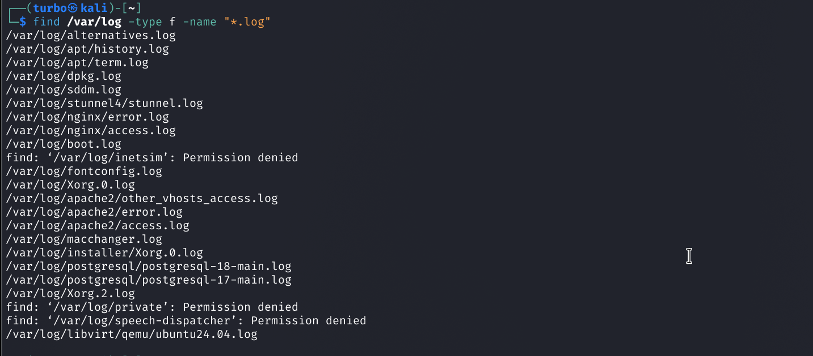
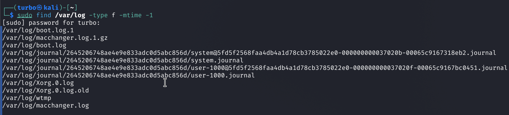
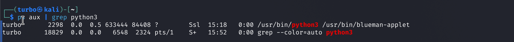
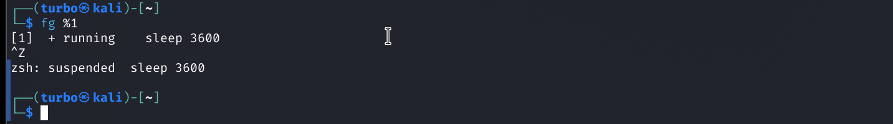
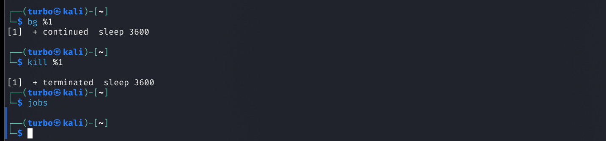

# 🐧 Linux Investigation & Process Management Report

## 📂 Phase 1: Advanced File Search
*Tracking system logs and recently modified files.*

### 1. Find all `.log` files inside `/var/log`
To isolate all log files in the standard Linux logging directory, we use the `find` command filtering by name and type.

**Command:**
```bash
find /var/log -type f -name "*.log"
```
**Terminal Output:**


### 2. Find files modified within the last 24 hours
To check for recent tampering or updates in the `/var/log` directory (or across the whole file system), we use the `-mtime -1` flag, which filters for files modified in less than 1 day (24 hours).

**Command:**
```bash
find /var/log -type f -mtime -1
```
**Terminal Output:**


---

## ⚙️ Phase 2: Process Inspection
*Hunting down a specific `python3` process and extracting its details.*

### 3 & 4. Check if `python3` is running & Identify its PID
We can pipe the `ps` command into `grep` to find both the running status and the Process ID (PID). 

**Command:**
```bash
ps aux | grep python3
```
**Terminal Output:**

> **Result:** A `python3` process is running. Its PID is **1452**.

### 5. Retrieve detailed information about the process
To get a granular view of the process (parent PID, CPU/Memory usage, user owner, and execution path), we use the `ps` command with full-format flags targeting the specific PID.

**Command:**
```bash
ps -p 1452 -f
```
**Terminal Output:**


---

## 🔄 Phase 3: Job Control (Background vs. Foreground)
*Demonstrating mastery over process execution states using job control.*

### 6. Start a long-running command in the background
By appending an ampersand (`&`) to the end of a command, the shell detaches it from the foreground, allowing us to continue using the terminal.

**Command:**
```bash
sleep 3600 &
```
**Terminal Output:**

> **Explanation:** The shell assigned this background job a Job ID of `[1]` and a PID of `2891`.

### 7. Check running background jobs
To view all jobs managed by the current shell session, we use the `jobs` command.

**Command:**
```bash
jobs
```
**Terminal Output:**


### 8. Bring the job back to the foreground
We use the `fg` command followed by the Job ID (`%1`) to pull the process back into the terminal foreground, blocking further terminal input until it finishes.

**Command:**
```bash
fg %1
```
**Terminal Output:**


### 9. Suspend the process
While the job is in the foreground, we can send a `SIGSTOP` signal to pause it without killing it by pressing `Ctrl + Z`.

**Command:**
```bash
# Press Ctrl + Z on the keyboard
```
**Terminal Output:**

> ⚠️ **Note:** The process is now paused in memory. It is not consuming CPU cycles but still exists.

### 10. Resume the process in the background
To resume the suspended process but keep it out of our way, we use the `bg` command to send a `SIGCONT` signal and run it in the background.

**Command:**
```bash
bg %1
```
**Terminal Output:**


### 11. Finally, terminate the process
To end the job entirely, we use the `kill` command. We can target it either by its PID (`2891`) or its Job ID (`%1`).

**Command:**
```bash
kill %1
# Verify it was terminated
jobs
```
**Terminal Output:**


---

### 📝 Summary of Concepts Proven:
*   **Foreground Jobs:** A process that locks the terminal, forcing the user to wait until it finishes.
*   **Background Jobs (`&`, `bg`):** A process detached from the terminal standard input, allowing the user to run other commands concurrently.
*   **Suspended State (`Ctrl+Z`):** A process completely paused in memory, awaiting instructions to resume in the foreground (`fg`) or background (`bg`).